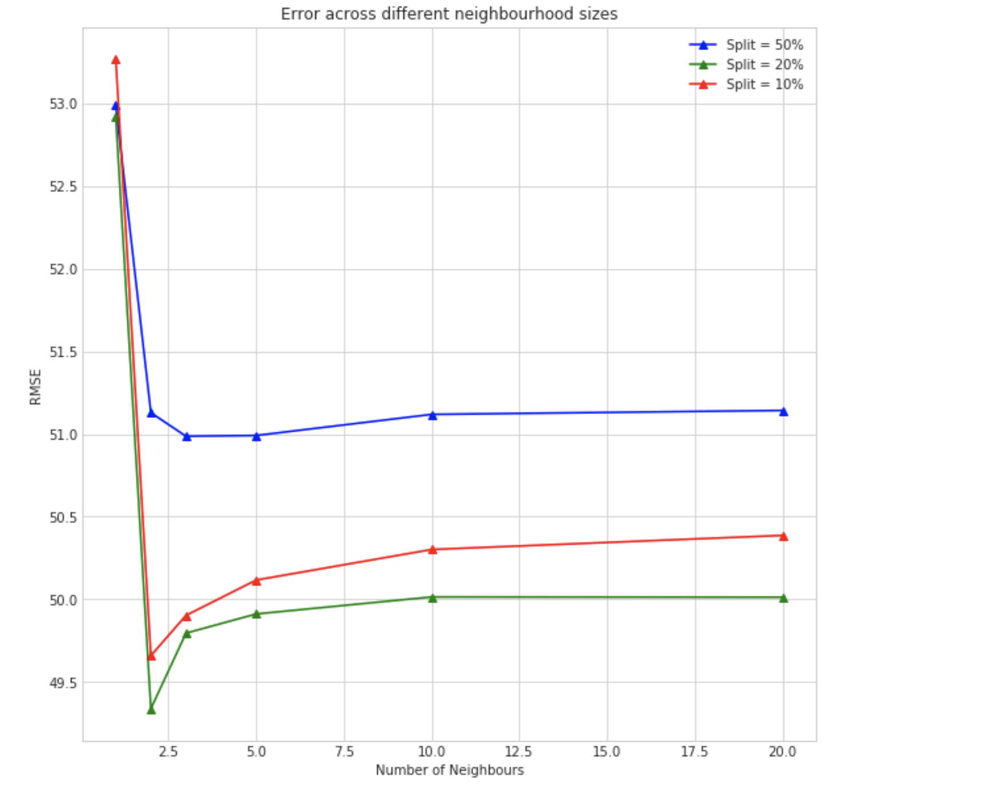

# Personalization Theory Project

## PROBLEM STATEMENT
- For the purposes of tasks presented in HW2, we regard ourselves as a movie recommendation and review website which prides itself with quality recommendations that it is able to generate for our its registered users. 
- Our business model is built around selling our customers subscription and online purchase services to go and watch their favorite movies. 
- Another part of our job is to engage users on our platform, so that they actively use it to review new movies. This will ensure that we continuously build a growing repository of data that is both rich and relevant with changing time.
- One way of sending out these recommendations is through
- TLDR; **Maximize:** Online Purchases and Website Engagement , **Avoid:** Becoming a Spammer. Focus on Quality Recommendations. The objective then is to identify what number of active users on platforms should be targeted and with what frequency.
- Make Top 5 recomendation to a carefully selected subset of registered users.

## DATASET:
- We are using the Movielens Dataset. 
- There were 2 subsets that we created. The small dataset consisted of 610 users and 100 movies while the large dataset consisited of 10000 users and 100 movies. The movies were chosen first after which the dataset was filtered for the users. 
- The movies were the same across both the datasets. 

### MODELS
- Item Based Collaborative Filtering Model
* Hyperparameters: Neighborhood Size - k; 
* Evaluation Metric: Root Mean Square Error
- Matrix Factorisation with Regularisation
* Hyperparameters: Latent Space Dimensions- k; Other Paramters: learing rate - alpha; reg. paramter - beta.

## PARAMETER TUNING OF MODELS
- To identify the number of neighbours for the Item Based Collaborative Filtering Model, we split the dataset into 3 different training and testing ratios. 
-- A ratio of 50:50 of the training and test data
-- A ratio of 80:20 of the training and test data
-- A ratio of 90:10 of the training and test data
- Once we had split the data into the training and testing dataset, we chose some different neighbourhood sizes 
- Calculating the RMSE error across the 3 different splits for the different cneighbourhood choices, we chose the neighbourhood size k which achieved the minimum RMSE. 
- To identify the number of latent factors for Matrix Factorisation with Regularisation, we again split the data into different training and testing ratios
- The k denoting the number of Latent Space Dimensions was chosen based on the RMSE across the different training and testing splits

### RESULTS
#### Impact of Sample Size: 
To understand the impact of growing data and increasing sparsity, we divide our projct over two experiments.
- In Experiment 1: With low number of number and low sparsity, the value of k didn't make much of a difference.
- In Experiment 2: With more number of users and high sparisty, 

| MF - Small Sample ( 610 Users )  |  MF - Large Sample ( 10k Users )|
|----------------------------------|---------------------------------|
||

To see the impact of neighbourhood sizes, we plotted the graph below
 

Some key points seen were 
- When we use a single neighboour to predict the ratings, we get a really high root mean square error across the three different splits of training and testing data when the neighbourhood size is 1
- The lowest root mean square error occurs at an 80:20 train to test split.
- The error is higher at a 90:10 split compared to the 80:20 split. This indicates an overfitting on the training data and the model does not generalize well
- When using 100 items, a neighbourhood size of 2 gives the best results. A simple model with 2 neighbours is able to explain better than a model which has more number of neighbours

#### Design Choices to consider: 
In both of our models we have not included important features like movie titles, genres and celebrities starring in  them. We can also factor in context aware features like time and location. Take time for example, we would want to study how old are the ratings provided by a user before assigning them equal importance to a recent rating.

### How to run
* download the datset from ??
* run `python 9_format_and_fix.py output/merged.csv output/submission.csv`

### Requirements
* Python 3.5 with standard scientific packages (pandas, numpy, scipy, etc.)
* 16gb of RAM
* About 40gb free space

### Reference environment
We ran the models using the following python version and packages:
```
Python 3.5.2 (we used the conda environment)
pandas 0.22.0
numpy 1.14.0
matplotlib 2.0.2
scipy 1.0.0
```
